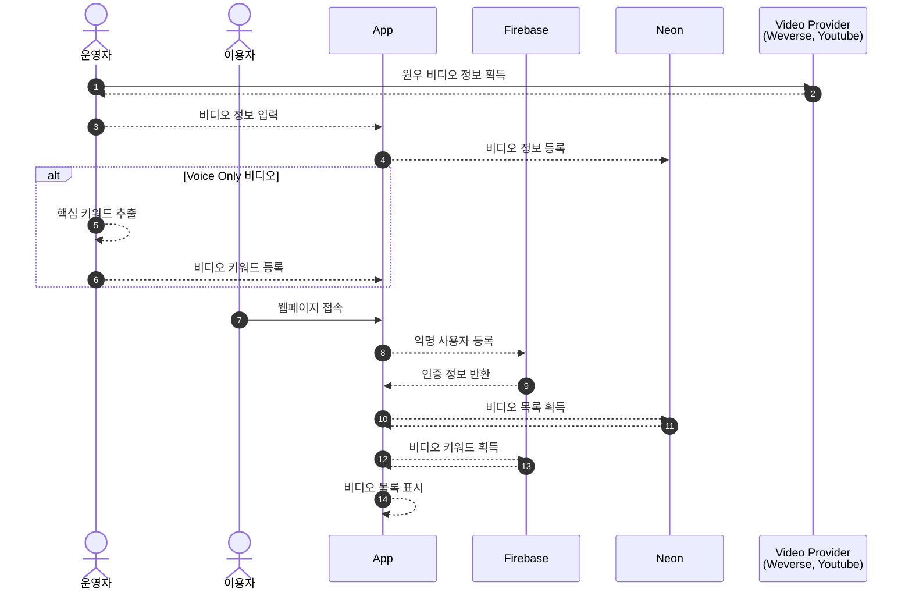

# Wonwoo Video

Wonwoo Video는 세븐틴 멤버 원우와 관련된 비디오를 갤러리 형식으로 제공합니다. 다국어 검색 지원 기능을 포함하고 있습니다.

이 프로젝트는 아래와 같은 불편 사항을 해소하고, 원우 팬들이 더 쉽게 원우 비디오를 시청 하는 것을 돕기 위해 시작되었습니다.

* 위버스 라이브, 유튜브 세븐틴 채널(모바일)에서 검색 기능을 제공하지 않음 - 비디오 검색 기능을 제공하지 않아 사용자는 보고 싶은 원우 비디오가 있을 경우 스크롤을 반복해야 함
* 비디오 식별의 어려움
  * (위버스 라이브) 검색 기능 미제공으로 인해 비디오를 북마크 하더라도 영상 다수가 같은 섬네일 이미지를 사용하고 있어 비디오간 구분이 어려움
  * 별도의 섬네일 이미지를 제공하지 않는 위버스 라이브 보이스의 경우, 날짜나 제목으로 영상의 내용을 짐작하기 어려움

## 프로세스 및 작동 방식

원우 비디오는 아래와 같은 방식으로 동작합니다.

1. 위버스 라이브, 유튜브 등에서 원우 비디오 정보(URL, 섬네일 이미지 URL 등) 획득 후 DB에 저장
  * 보이스 온리 비디오일 경우, 영상의 자막에서 주요 키워드를 추출 후 DB에 추가 저장 - 한국어 키워드를 기반으로 자동 번역된 키워드 추가 입력하여 다국어 지원
2. DB에 입력된 비디오를 섬네일 이미지 또는 영상 키워드와 함께 갤러리 형식으로 제공

[참고]
* (5) Natural Language Process 사용하여 키워드 추출하고 있으나, 일상적인 대화가 특성인 라이브의 특성상 특정 맥락을 파악 할 수 없거나, 불용어 사용 빈도가 높음. 결과적으로는 유의미한 키워드 추출을 위해 운영자의 개입이 매우 큰 부분으로, 추후 사용자의 키워드 입력(+ 투표) 기능 등으로 개선 여지 있음. 
* (8) 비인가 api 호출을 방지하기 위해 Firebase authenticate의 Anonymouse Signup을 사용

## 사용 기술
React 19, Typescript, Tailwind, PostigreSQL
